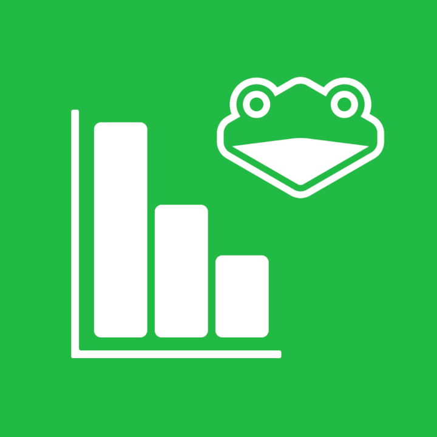

# SlippiStatsBot
A Discord bot dedicated to analysis of Project Slippi SLP replay files on Discord.
---

------

### Table of Contents

- [Using SlippiStatsBot](#using-slippistatsbot)
- [Can I use this in my server?](#can-i-use-this-in-my-server)
- [TODO](#todo)
- [Libraries Utilized](#libaries-utilized)
- [Development](#development)

### Using SlippiStatsBot

To activate Slippi replay file analysis, call `/analyze` upload the `.slp` replay file to the message. SlippiStatsBot will then analyze the replay file and display statistics from the game. 

You can select the dropdown to see which set of statistics you want to view.

#### Other commands

These commands are slash commands, meaning they are preceded with a `/`.

- `about` - displays information about the bot, and links to this repository
- `ping` - pings the client that is running the bot for its response time

### Can I use this in my server?

Currently, this Discord bot isn't being hosted anywhere, so the bot is currently offline. Should I choose to host this bot in the future (whenever it may be), I will make preparations to make it available to people, including an invite link and a way to generate funds to keep this thing online.

You could also run this thing locally, and for that you might want to go down to [Development](#development) for help on how to get up and running.

### TODO

- High Priority
  - Move file storage to a database like MongoDB (as opposed to local file storage)
- Low Priority
  - Include link to/txt file of JSON data to be used elsewhere when appropriate flag is activated
  - Put the replay analysis into a new thread instead of the chat

### Libaries Utilized
This Discord bot was made with the following Node.js packages
- [discord-ts](https://discordx.js.org/) - A superset of [discord.js](https://discord.js.org/#/) with TypeScript decorators to improve readability
- [slippi-js](https://github.com/project-slippi/slippi-js) - A JavaScript/TypeScript library for parsing Project Slippi replay files for Super Smash Bros. Melee
- [table](https://www.npmjs.com/package/table) - Simple library that produces a row-column table with ASCII characters
- [Axios](https://axios-http.com/) - Promise based HTTP client for Node.js
- [ts-dotenv](https://www.npmjs.com/package/ts-dotenv) - Library that implements `.env` files to hold the Discord bot's token
- [lodash](https://lodash.com/) - JS Utility Library

### Development
- `git clone` this repository and navigate into it
- `npm install`
- Create the file `.env` in the root directory and include the line `BOT_TOKEN=<bot-token-id>` where you replace `<bot-token-id>` with your own from the [Discord developer portal](https://discord.com/developers/).
- `npm run build`
- `npm run start`
you are done, you will see your bot up and running. For detailed installation guide, please [see this](https://discordx.js.org/docs/discordx/getting-started)

