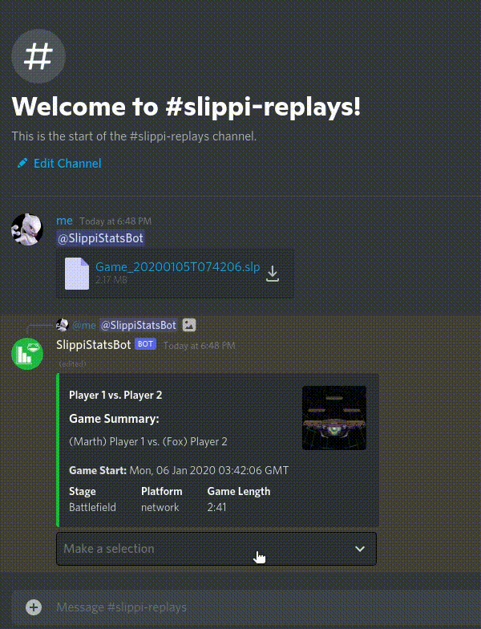

# SlippiStatsBot
A Discord bot dedicated to analysis of Project Slippi SLP replay files on Discord.
---

------

### Table of Contents

- [Using SlippiStatsBot](https://github.com/shrianshChari/SlippiStatsBot#using-slippistatsbot)
- [TODO](https://github.com/shrianshChari/SlippiStatsBot#todo)
- [Libraries Utilized](https://github.com/shrianshChari/SlippiStatsBot#libaries-utilized)
- [Development](https://github.com/shrianshChari/SlippiStatsBot#development)

### Using SlippiStatsBot

To activate Slippi replay file analysis, mention the bot and upload the `.slp` replay file to the message. SlippiStatsBot will then analyze the replay file and display statistics from the game. 

You can select the dropdown to see which set of statistics you want to view.

#### Other commands

These commands are slash commands, meaning they are preceded with a `/`.

- `about` - displays information about the bot, and links to this repository
- `ping` - pings the client that is running the bot for its response time

### TODO

- High Priority
  - If the user empty pings the bot (pings w/o a Slippi file or any other message content), remind them to upload a SLP file with a friendly wave
  - Grab all of the images in the [slippi-launcher repo](https://github.com/project-slippi/slippi-launcher/tree/main/src/renderer/styles/images/stages) and put them into a repo that I can easily grab from
- Low Priority
  - Figure out custom stock emojis to display final stock count
  - Flags/arguments to include/not include certain stages
  - Include link to/txt file of JSON data to be used elsewhere when appropriate flag is activated
  - Fix/replace first GIF (it's really large for no reason)

### Libaries Utilized
This Discord bot was made with the following Node.js packages
- [discord-ts](https://discord-ts.js.org/) - A superset of [discord.js](https://discord.js.org/#/) with TypeScript decorators to improve readability
- [slippi-js](https://github.com/project-slippi/slippi-js) - A JavaScript/TypeScript library for parsing Project Slippi replay files for Super Smash Bros. Melee
- [table](https://www.npmjs.com/package/table) - Simple library that produces a row-column table with ASCII characters
- [Axios](https://axios-http.com/) - Promise based HTTP client for Node.js
- [ts-dotenv](https://www.npmjs.com/package/ts-dotenv) - Library that implements `.env` files to hold the Discord bot's token

### Development
- `git clone` this repository and navigate into it
- `npm install`
- Create the file `.env` in the root directory and include the line `BOT_TOKEN=<bot-token-id>` where you replace `<bot-token-id>` with your own from the [Discord developer portal](https://discord.com/developers/).
- `npm run build`
- `npm run start`
you are done, you will see your bot up and running. For detailed installation guide, please [see this](https://oceanroleplay.github.io/discord.ts/docs/installation)

